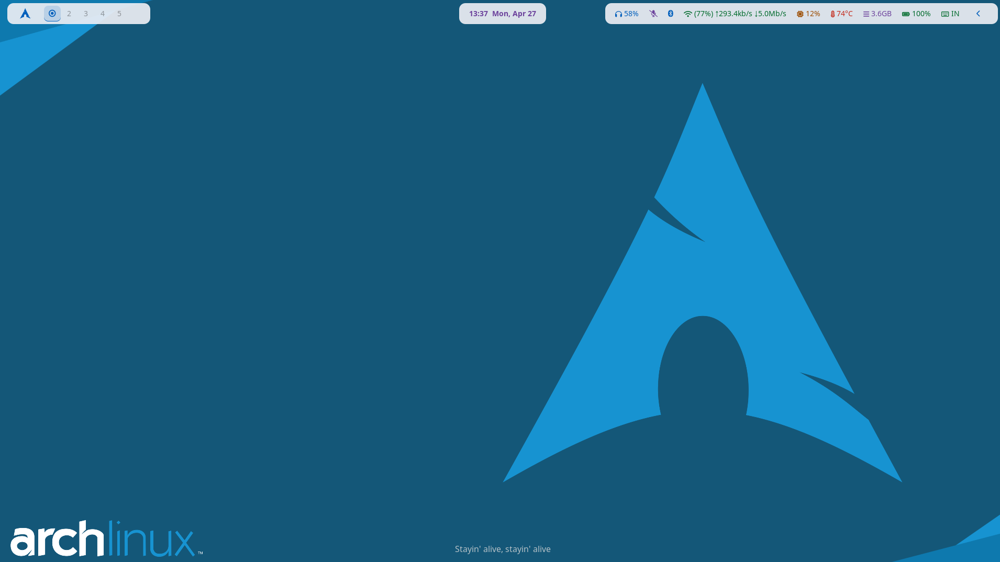
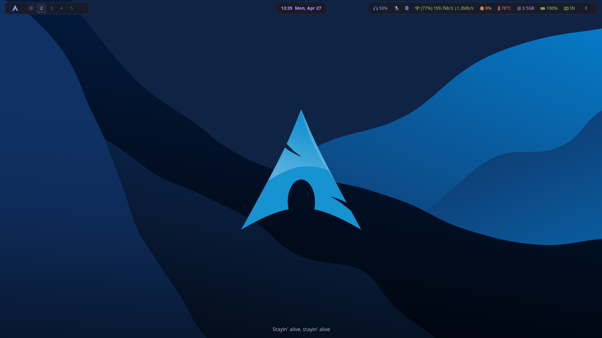
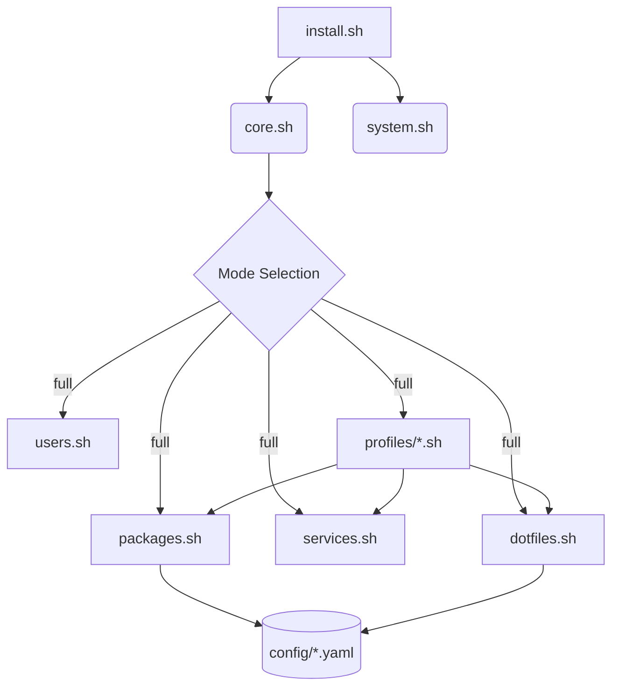

# Arch Linux Post-Installation Workbench

<div align="center">
  
  
</div>

A highly modular, automated, and visually polished Arch Linux post-installation framework. Transforms a fresh Arch install into a production-ready **Hyprland** workstation with curated aesthetics and a centralized theming engine.

<div align="center">

[](https://hyprland.org)
[](https://archlinux.org)
[](https://www.gnu.org/software/bash/)
[](https://neovim.io)
[](https://github.com/catppuccin/catppuccin)
[](https://opensource.org/licenses/MIT)

</div>

---

## Table of Contents

- [Features](#features)
- [How it Works](#how-it-works)
- [Requirements](#requirements)
- [Quick Start](#quick-start)
- [Usage](#usage)
- [File Structure](#file-structure)
- [Theming System](#theming-system)
- [Keybindings](#keybindings)
- [Included Stack](#included-stack)
- [Troubleshooting](#troubleshooting)
- [Customization](#customization)
- [Contributing](#contributing)
- [License](#license)

---

## Features

| Feature | Description |
|:---:|:---|
| 🧱 | **Modular Design**: Packages, services, and dotfiles are decoupled into core modules and environment profiles. |
| 🧩 | **Plugin-based Profiles**: Easily add new desktop environments (e.g., GNOME, KDE) by dropping a script into `profiles/`. |
| 🎨 | **Unified Theming**: Dark (Macchiato) and Light (Latte) themes applied via `SUPER + N`. |
| 👤 | **Profile-Based**: Supports `full`, `base`, or `dotfiles` installation modes. |
| 🔄 | **Idempotent**: Uses `--needed` flags and pre-flight checks for safe re-runs. |
| 📜 | **Robust Logging**: Every step is timestamped and logged to `logs/`. |
| 🔗 | **Symlinked Dotfiles**: Automated deployment with automatic backups of existing configs. |

---

## How it Works

The workbench operates as a modular engine that parses YAML configurations to drive the installation.



### Installation Lifecycle

1. **Pre-flight**: Verifies Arch Linux, internet connectivity, and sudo privileges.
2. **Core Setup**: Updates system and ensures `yay` (AUR helper) and `yq` (YAML parser) are available.
3. **Module Execution**:
   - **System**: Installs fonts and configures the system shell.
   - **Packages**: Installs pacman and AUR packages listed in configs.
   - **Services**: Enables systemd services and timers.
   - **Users**: Configures shell, groups, locale, and timezone.
   - **Profiles**: Environment-specific orchestrators (like Hyprland) execute their logic.
   - **Dotfiles**: Symlinks configurations from `dotfiles/` to `~/.config/` with automatic backups.

---

## Requirements

- Arch Linux (fresh installation)
- Non-root user with `sudo` privileges
- Active internet connection
- Git installed (`pacman -S git`)

---

## Quick Start

```bash
git clone https://github.com/beyondSachin/arch-post-install.git
cd arch-post-install
chmod +x install.sh
./install.sh
```

---

## Usage

### Interactive Mode

```bash
./install.sh
```

### Modes

| Mode | Description |
|------|-------------|
| `full` | Base + Hyprland + dotfiles (default) |
| `base` | System essentials only (no DE) |
| `dotfiles` | Deploy configurations only |

### Command Line Options

| Option | Description |
|--------|-------------|
| `-v, --verbose` | Enable verbose output |
| `-d, --dry-run` | Preview actions without executing |
| `-h, --help` | Show help message |

### Examples

```bash
./install.sh full           # Full install non-interactively
./install.sh -v base        # Verbose base install
./install.sh -d dotfiles    # Preview dotfiles deployment
```

### Makefile

```bash
make full                   # Full install (base + Hyprland + dotfiles)
make base                   # Base packages only
make dotfiles               # Deploy dotfiles
make fonts                  # Install fonts
make fish                   # Setup Fish shell
make check                  # Check prerequisites
make help                   # Show all targets
```

With flags:
```bash
make full V=1               # Verbose output
make dotfiles DRY=1         # Dry-run mode
```

---

## File Structure

```
arch-post-install/
├── install.sh                 # Main entry point
├── ARCHITECTURE.md            # Technical design documentation
├── Makefile                   # Development shortcuts & automation
├── config/
│   ├── base.yaml              # Core packages & system settings
│   └── hyprland.yaml          # Hyprland packages, services & dotfiles
├── modules/
│   ├── core.sh                # Engine: YAML parsing, logging, checks
│   ├── system.sh              # System-wide setup (fonts, shell)
│   ├── packages.sh            # Pacman & AUR package installation
│   ├── services.sh            # Systemd service management
│   ├── users.sh               # User configuration & locale
│   └── dotfiles.sh            # Symlink deployment with backup
├── profiles/
│   └── hyprland.sh            # Hyprland environment orchestrator (plugin)
├── dotfiles/
│   ├── theme/                 # Unified theme definitions
│   ├── hypr/                  # Hyprland window manager config
│   ├── waybar/                # Status bar configuration
│   ├── kitty/                 # Terminal emulator config
│   └── ...                    # (See ARCHITECTURE.md for full list)
├── scripts/
│   ├── install_yay.sh         # AUR helper setup
│   ├── setup_fish.sh          # Fish + Fisher + plugins
│   ├── setup_kwallet.sh       # PAM configuration for KWallet auto-unlock
│   └── fonts.sh               # Font installation
├── assets/                    # Repository branding & documentation media
└── logs/                      # Timestamped installation logs
```

---

## Theming System

The unified theme engine uses **Catppuccin** color palettes for a consistent, eye-pleasing experience.

- 🌑 **Dark Mode**: Catppuccin Macchiato
- ☀️ **Light Mode**: Catppuccin Latte

Toggle themes instantly with **`SUPER + N`**. The system synchronizes the following components:

1. **Hyprland** - Borders, active window glow, and workspace indicators.
2. **Waybar** - CSS variables for background, text, and accent colors.
3. **Kitty / Alacritty** - Terminal color schemes.
4. **Rofi** - Dynamic RASI variables for launchers and menus.
5. **GTK/Qt** - System-wide interface preferences (Dark/Light preference).
6. **Neovim** - Integrated theme switching for LazyVim.

---

## Keybindings

| Keybinding | Action |
|------------|--------|
| `SUPER + Return` | Launch terminal (Kitty) |
| `SUPER + Space` | App launcher (Rofi) |
| `SUPER + E` | File manager |
| `SUPER + B` | Web browser |
| `SUPER + N` | Toggle Dark/Light theme |
| `SUPER + M` | System menu |
| `SUPER + L` | Lock screen |
| `SUPER + C` | Close active window |
| `SUPER + Shift + C` | Calendar & Tasks (Calcure) |
| `SUPER + Shift + Q` | Kill session |
| `Print` | Screenshot (selection) |

---

## Included Stack

| Category | Components |
|:---:|:---|
| **Compositor** | [Hyprland](https://hyprland.org), [hyprpaper](https://github.com/hyprwm/hyprpaper), [hypridle](https://github.com/hyprwm/hypridle), [hyprlock](https://github.com/hyprwm/hyprlock) |
| **Bar/UI** | [Waybar](https://github.com/Alexays/Waybar), [Dunst](https://dunst-project.org/) |
| **Launcher** | [Rofi](https://github.com/davatorium/rofi) (Modern, Spotlight, Launchpad themes) |
| **Terminal** | [Kitty](https://sw.kovidgoyal.net/kitty/), [Alacritty](https://alacritty.org/) |
| **File Manager** | [Nautilus](https://apps.gnome.org/Nautilus/), [Yazi](https://github.com/sxyazi/yazi) |
| **Editor** | [Neovim](https://neovim.io) ([LazyVim](https://lazyvim.github.io) setup) |
| **Productivity** | [Calcure](https://github.com/anufrievroman/calcure) (Calendar & Tasks TUI) |
| **Multiplexer** | [Zellij](https://zellij.dev/) |
| **Browser** | [Chromium](https://www.chromium.org/) |
| **Media** | [MPV](https://mpv.io/), [imv](https://github.com/epezent/imv), [feh](https://feh.finalrewind.org/), [Evince](https://wiki.gnome.org/Apps/Evince) |
| **Audio** | [PipeWire](https://pipewire.org/), [WirePlumber](https://pipewire.pages.freedesktop.org/wireplumber/) |
| **Network** | [NetworkManager](https://wiki.archlinux.org/title/NetworkManager), [iWD](https://iwd.wiki.kernel.org/) |
| **Security** | [KWallet](https://utils.kde.org/projects/kwalletmanager/), `pam_kwallet` |
| **Theming** | [Papirus Icons](https://github.com/PapirusDevelopmentTeam/papirus-icon-theme), [Adwaita](https://gnome.pages.gitlab.gnome.org/libadwaita/doc/), [Kvantum](https://github.com/tsujan/Kvantum) |

---

## Troubleshooting

### Sudo requires password every time

Add to `/etc/sudoers` (use `visudo`):
```
username ALL=(ALL) NOPASSWD: ALL
```

### Fonts look broken

```bash
make fonts
```

### Theme toggle not working

Ensure the toggle script is executable:
```bash
chmod +x ~/.config/hypr/scripts/toggle_theme.sh
```

### AUR packages fail to build

Install required build tools:
```bash
sudo pacman -S --needed base-devel
```

### Hyprland doesn't start

Check logs:
```bash
cat ~/.hyprland/hyprland.log
```

### Sound not working

```bash
pulseaudio --kill
systemctl --user restart pipewire pipewire-pulse wireplumber
```

---

## Customization

### Add custom packages

Edit `config/base.yaml` or `config/hyprland.yaml`. The workbench automatically skips already installed packages.

```yaml
packages:
  pacman:
    - firefox
    - vlc
  aur:
    - visual-studio-code-bin
    - spotify
```

### Add dotfiles

Place your configuration directory in `dotfiles/` and add it to `config/hyprland.yaml`. Existing directories in `~/.config/` will be backed up automatically.

```yaml
dotfiles:
  - my-cool-app-config
```

### Change default theme

The theme system is centralized. Edit `dotfiles/theme/config.conf` to switch between flavors:
```bash
THEME=macchiato   # Dark mode
# OR:
THEME=latte       # Light mode
```

### Advanced: Custom Profiles

The workbench supports a plugin-based architecture for desktop environments. To add a new profile (e.g., `gnome`):

1. Create `config/gnome.yaml` with required packages and dotfiles.
2. Create `profiles/gnome.sh` and define a `setup_gnome()` function.
3. Add `run_cmd setup_gnome` to the `full` case in `install.sh`.

---

## Contributing

Contributions are welcome! Please read our [CONTRIBUTING.md](CONTRIBUTING.md) and [CODE_OF_CONDUCT.md](CODE_OF_CONDUCT.md) for details on our code of conduct and the process for submitting pull requests.

---

## License

MIT License - see [LICENSE](LICENSE) for details.

---

## Credits

- [Hyprland](https://hyprland.org) - Dynamic tiling compositor
- [Catppuccin](https://github.com/catppuccin/catppuccin) - Color palettes
- [LazyVim](https://lazyvim.github.io) - Neovim configuration
- All open-source contributors
